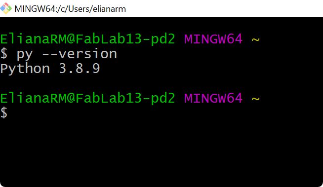
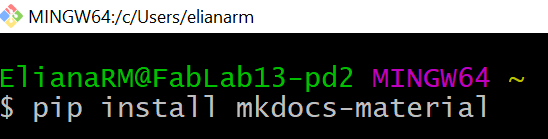
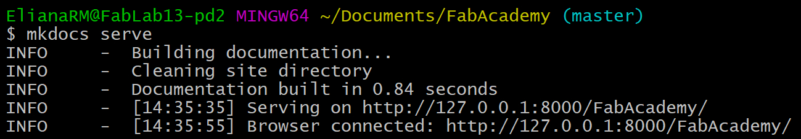
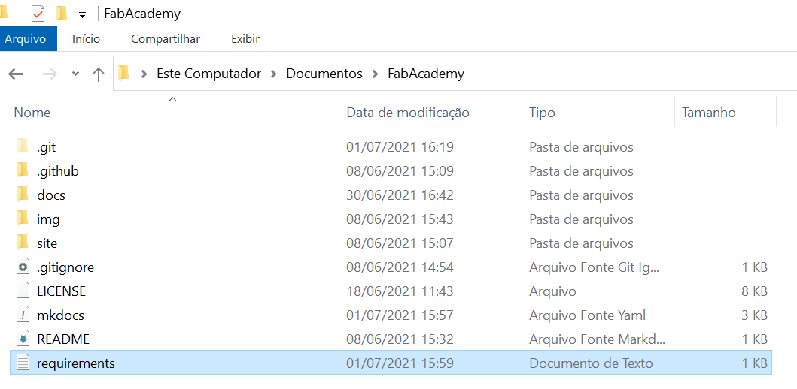
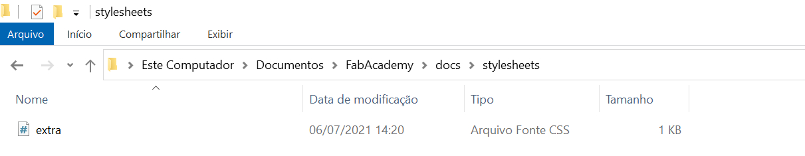

# 2. Project Management

## Assignment

* Build a personal site describing you and your final project.
* Work through a git tutorial.

##What's Git and GitHub? How can I use them with MkDocs?:anguished:

And finally what is Markdown? :eyes:

I had a difficult time understanding the purpose of each one (Git, GitHub, MkDocs and Markdown) and how to use them together to create a site.
Fortunately, in my work team, we were talking about interesting courses on [Alura platform](https://www.alura.com.br/) that we could take to improve our skills, and Git/GitHub course was one of them. I didn't conclude it, but it gave me a good knowledge about how Git and GitHub run.

My second move was searching examples of Fab Academy websites and the [Cheng Pan's](http://fabacademy.org/2020/labs/oshanghai/students/pan-cheng/) documentation give me a clear ideia about the structure.

Beyond it, my coworker **Luís Henrique Fonseca** has already built a website called [Robozito](https://luishfb.github.io/Doc_Robozito/) using MarkDown, MkDocs, Git and GitHub, so it helped me a lot.

## Research

* [**Git**](https://blog.betrybe.com/tecnologia/git-e-github/) is an open-source version control system, in other words, free of charge. It's used for creating a history of changes in the source code of software's development projects. It was designed by Linus Torvalds, the creator of the Linux operating system.

* [**Github**](https://blog.betrybe.com/tecnologia/git-e-github/) is a remote repository created as an online Git repository hosting service.

* [**MkDocs**](https://www.mkdocs.org/) is a fast, simple and downright gorgeous static site generator that's geared towards building project documentation. Documentation source files are written in Markdown, and configured with a single YAML configuration file.

* [**Markdown**](https://blog.bit.ai/what-is-markdown/) was created back in 2004 by John Gruber (of Daring Fireball) as an easy way for non-coders to write in a format that could be easily converted into HTML. John Gruber defines Markdown as, “A text-to-HTML conversion tool for web writers. Markdown allows you to write using an easy-to-read, easy-to-write plain text format, then convert it to structurally valid XHTML (or HTML)“.

## Creating a personal site: **Windows operating system**

Here the steps that I did to create my personal site:

1. Install [Python 3.8.9](https://www.python.org/downloads/);

2. Install [Git](https://git-scm.com/downloads) and let the Git Bash terminal be started;

3. In Git Bash terminal, type `py --version` to see if the process worked out;


    {style="height:100px"}


4. For downloading libraries from Git repositories, it's necessary the package manager of python, PIP. Type `pip --version` to see if it has already been installed;

    { style="height:100px"}

5. For starting the website follow [Getting Started](https://www.mkdocs.org/getting-started/) page of MkDocs. It'll create all the basics files of the site on the local computer and give instructions of how to make changes in each page;

6. Changing the theme: my personal site uses a theme called [Material for MkDocs](https://squidfunk.github.io/mkdocs-material/) that can be installed by the command `pip install mkdocs-material` on the computer system;

    <left>
    {: style="height:80px"}
    </left>

    !!! Important "In `mkdocs.yml`, change theme for `material`"
        ```
        theme:
          name: material
        ```

7. For hosting it on GitHub follow the [Allythy tutorial](https://allythy.github.io/como-criar-documentacao-com-mkdocs) from "Deploy para o GitHub" topic until the end. It'll also generated the URL of documentation, similar of mine https://rmeliana.github.io/FabAcademy/;

8. Locally, on the computer, changes in the site can be seen by the command `mkdocs serve` and URL http://127.0.0.1:8000/....
<center>
{: style="height:100px"}
</center>

    However, once the files are on GitHub and it's made an update, a deployment process is needed in order to get updates published to GitHub Pages. For automating that, create a GitHub action following [Parker Erickson tutorial](https://parkererickson.github.io/portfolio/blog/MkDocsCD/);

    
    <figcaption align = "center"><b>Automatic GitHub deployment action</b></figcaption>

    !!! Important "Install all dependencies in order to deploy the updates."
        * Create a file called `requirements.txt` on the root of the main folder on the local computer and copy the text below in it.

        <center>
        {style="height:300px"}
        </center>

        * Requirements text
        ```
          mkdocs>=1.1
          Pygments>=2.4
          markdown>=3.2
          pymdown-extensions>=7.0
          mkdocs-material-extensions>=1.0
        ```

        * Add the command `pip install -r requirements.txt` into `main.yml` (this file is in **.github folder**):
        ```
        - name: Install dependencies
          run: |
            python -m pip install --upgrade pip
            pip install mkdocs-material
            pip install -r requirements.txt
        ```    

## Advices

### Mardown editor and Git IDE

I've started using [Notepad++](https://notepad-plus-plus.org/downloads/) for changing the pages of my personal site. It's an easy-to-use software and has already been installed on Windows.

<center>
{: style="height:400px"}
<figcaption><b>Notepad++ Software</b></figcaption>
</center>

For working with Git and its commands I used the Git Bash, including through it and the command `mkdocs serve` I could see the changes before push to online repository.

Therefore, I needed to switch between the two software for adding or modifying some info. Reading the documentation of student [Almir Kimura](http://fabacademy.org/2021/labs/insper/students/almir-kimurajunior/assignments/week02/) I discover another software that helps a lot with the process: [Atom](https://atom.io/). With it, I can make adjust in my files, see a preview of Markdown and push updates to GitHub, everything on the same window. Below, the red square is the text editor, the green is the preview and the orange is the Git communication.

<center>
{style="height:400px"}
<figcaption><b>Atom Software</b></figcaption>
</center>

### Image Alignment

I followed the references of [Material for MkDocs](https://squidfunk.github.io/mkdocs-material/reference/images/) for learning how to align images, but I realized that the commands didn't work as I wanted. The images didn't center, I couldn't have a caption below them, and left and right alignments put the pictures side by side with the text.

!!! info "How I did to correct the commands"
    === "Alignment"
        **Just switch the word `center` to `left` or `right` for making different alignments!**
        ```
        <center>
        {style="height:300px"}
        </center>
        ```
        or
        ```
        {.center style="height:240px"}
        ```
        To use this last option, it's necessary to create a folder called `stylesheet` into the folder `docs`. Lastly, generate a file `extra.css` and copy the code below in it.

        {.center style="height:120px"}

        ```
        .center {
            display: block;
            margin: 0 auto;
        }
        .left {
            float: left;
        }

        .right {
            float: right;
        }
        ```

    === "Image Caption"

        ```
        <center>
        {style="height:400px"}
        <figcaption><b>Help</b></figcaption>
        </center>
        ```

        Result:
        <center>
        {style="height:250px"}
        <figcaption><b>Help</b></figcaption>
        </center>

### Display Videos

!!! info "Videos"

    === "Youtube videos"
        1. Go to the Video page on YouTube and click on the Share Button.
        2. Choose Embed.
        3. Copy and Paste the HTML snippet in your markdown.

        example:
        ```
        <iframe width="534" height="300" src="https://www.youtube.com/embed/rptKlKZc7cs" title="YouTube video player" frameborder="0" allow="accelerometer; autoplay; clipboard-write; encrypted-media; gyroscope; picture-in-picture" allowfullscreen></iframe>
        ```

        Result:

        <iframe width="534" height="300" src="https://www.youtube.com/embed/rptKlKZc7cs" title="YouTube video player" frameborder="0" allow="accelerometer; autoplay; clipboard-write; encrypted-media; gyroscope; picture-in-picture" allowfullscreen></iframe>

    === "Local videos"
        Create an issue on the GitHub repository and attach the video. Then copy the address video and paste into the code below. For more details about visit this [site](https://medium.com/@jackywangdeveloper/tips-tricks-how-to-add-a-demo-video-in-your-git-readme-md-bbf8376a4b74).
        ```
        <center>
        <video controls width="385">

            <source src="https://user-images.githubusercontent.com/80481667/121596606-03fdfb80-ca16-11eb-96ab-62e88dee66aa.mp4"
                    type="video/mp4">

            Sorry, your browser doesn't support embedded videos.

        </video>
        </center>
        ```
