# 3. Computer Aided Design

## Assignment - Evaluate 2D and 3D software

* Model (raster, vector, 2D, 3D, render, animate, simulate, ...) a possible final project, compress your images and videos, and post it on your class page

## 2D software - Raster and Vector

### Inkscape

### Gimp

## 3D software
In my professional life, I have already worked with some 3D software to model technical parts. Such as [AutoCAD](https://www.autodesk.com.br/products/autocad/free-trial), [Inventor](https://www.autodesk.com.br/products/inventor/overview) and [Fusion 360](https://www.autodesk.com/campaigns/education/fusion-360), all products of Autodesk. Among them, nowadays, I use Fusion 360 for my work and personal projects.

### Autodesk Tinkercad

### Autodesk Fusion 360

I took a long time to design my final project because in each part I used to think about the processes of how to make it, what equipment or material I could choose or which one could be better. It was an exhausting assignment!

{style="height:200px"}
<figcaption><b>Just a little tired kkkkkk</b></figcaption>

I used a lot of commands to design the whole project. Here, I'll show some of them and give some tips too.

With my sketch on hand, I started to design the main part of my project, the vase of plant. I looked for a little one that I have in my house and took its measurements. Thinking about the geometrical forms that make up the vase helped me to model it easier.

#### First sketch

* I created a new sketch, and drew a circle with the dimension of the vase's base. I chose the plane XZ, but I realized that it'd be better if I had chosen the XY (the same orientation of CNC machines).

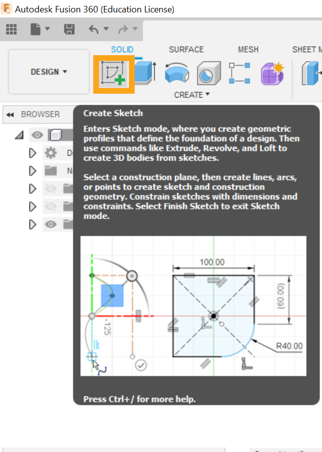{.center style="height:350px"}

!!! tip "It's a good idea to put the middle of the model at the origin coordinates (0,0)!"

{.center style="height:350px"}

* I needed to model a cone with its top cut off, and the command **Loft** was perfect for that. To do this, were needed two profiles. One I already had (in the step above). The other, I generated on a new plane using the command **Offset Plane**.

  

  {style="height:350px"}
  <figcaption><b>The command Offset Plane</b></figcaption>
  

  

  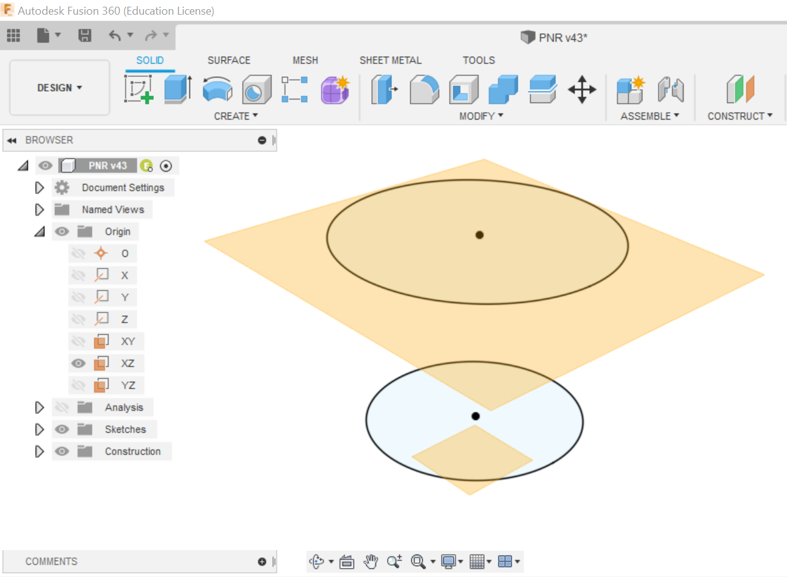{style="height:350px"}
  <figcaption><b>Two profiles on different planes</b></figcaption>
  

  

  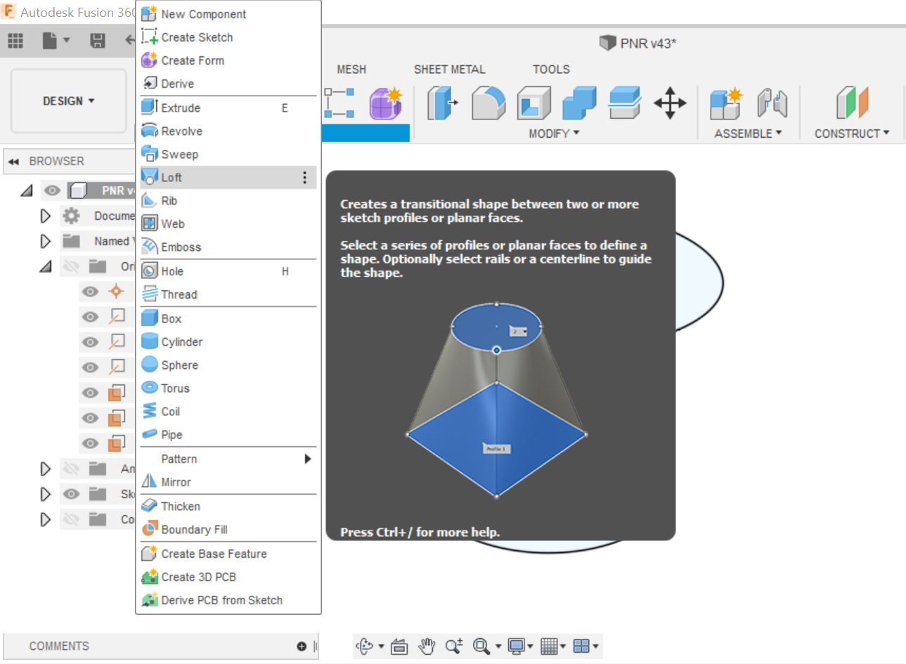{style="height:350px"}
  <figcaption><b>The command Loft</b></figcaption>
  

  

  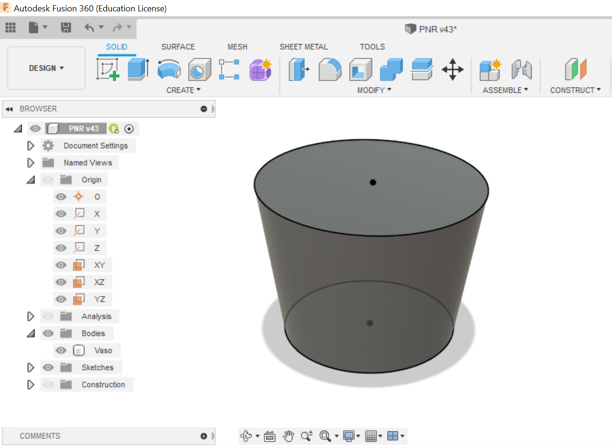{ style="height:350px"}
  <figcaption><b>The result of the command Loft</b></figcaption>
  

* I followed the sequence above to design the entire vase, and used the command **Shell** to create a hollow cavity.

  

  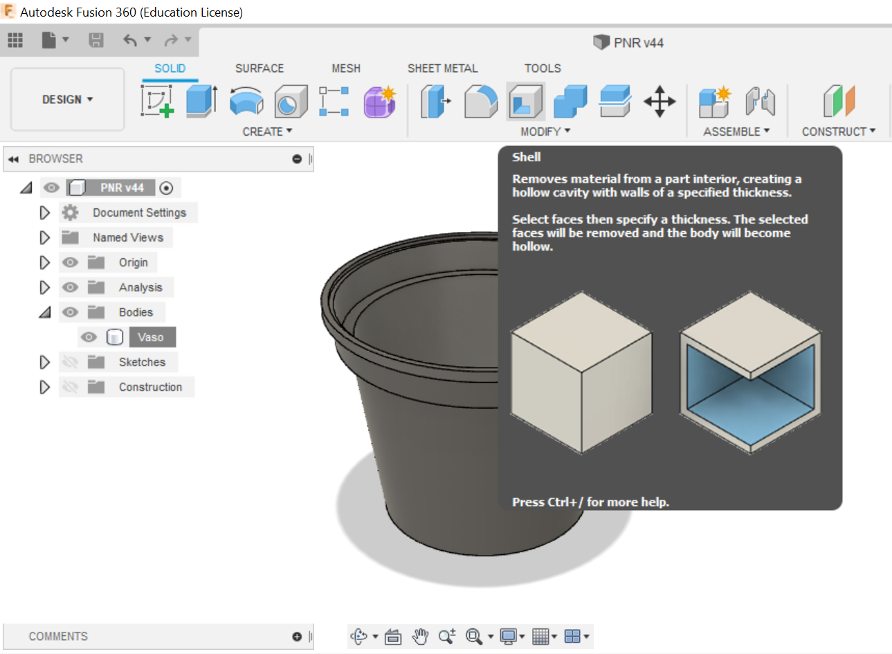{style="height:350px"}
  <figcaption><b>The command Shell</b></figcaption>
  

  

  | **3D Model**  | **Original Vase** |
  | :-----------: | :-----------:     |
  | 
 <iframe title="Plant Vase" frameborder="0" allowfullscreen mozallowfullscreen="true" webkitallowfullscreen="true" allow="fullscreen; autoplay; vr" xr-spatial-tracking execution-while-out-of-viewport execution-while-not-rendered web-share width="250" height="350" src="https://sketchfab.com/models/984c645ae9554f96a5047e8ea782d060/embed?ui_theme=dark"> </iframe> 
 | {style="height:350px"}  |

  

* With the main part drawn I could make it as a reference for others parts. In this step, the plate was being built following the same angle of the body of vase. After, by the command **Revolve**

{ style="height:350px"}
<figcaption><b>The sketch of plate</b></figcaption>

| The command Revolve |The result |
| :-----------------:  | :----------: |
| 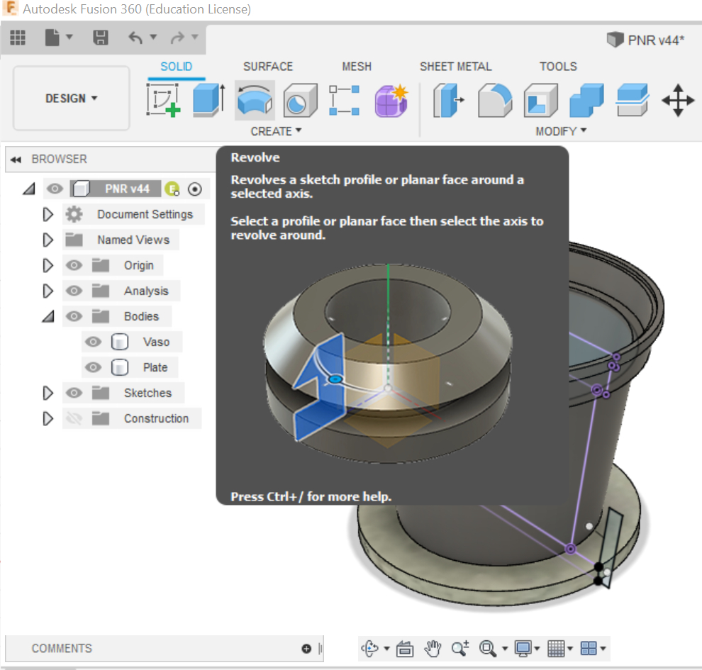{ style="height:400px"}  | 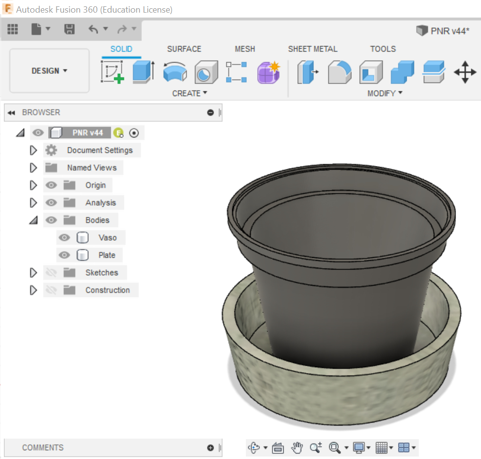{ style="height:400px"} |

#### McMaster-Carr Component

* In the virtual PNR project, I used screws and nuts to fix its parts. It's not necessary to design them. Fusion has a 3D model library called McMaster-Carr Component, where we can seek to them. There, I pulled: screws M5x30mm, wing nuts and springs.

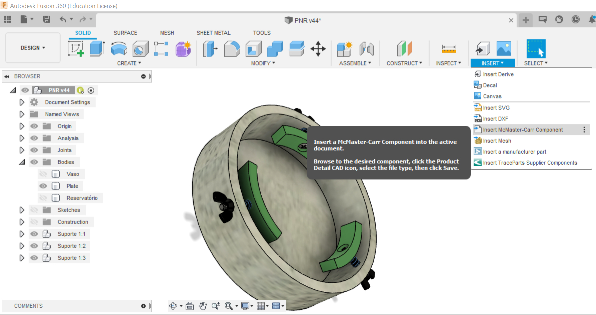{ style="height:350px"}
<figcaption><b>McMaster-Carr Component</b></figcaption>

| Wing Nuts available | The ones I pulled |
| :-----------------:  | :----------: |
| { style="height:350px"}  | {style="height:350px"} |

!!! tip "Another free 3D model library is the [GrabCAD](https://grabcad.com/)"
    It's an online community where people share their projects. I accessed it a couple of times. The first, I was looking for a example of water pump.

    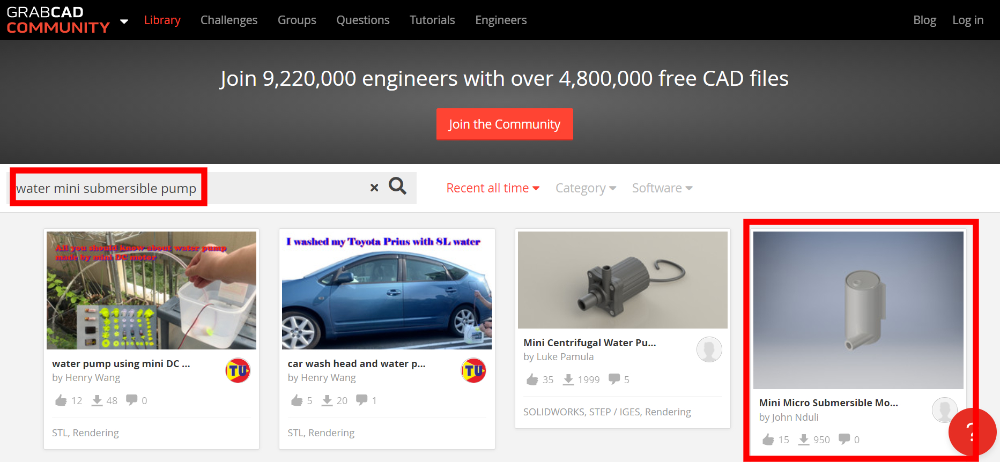{.center style="height:350px"}

    {.center style="height:350px"}

#### Changing Appearance

In Fusion, it's possible to atributte characteristics of materials for the parts. Press the letter `A` on the board, we can active the command **Appearance**. There're many types of materials, as metal, plastic, wood, and even concrete. Here, I aplied the concrete material in the part called Plate.

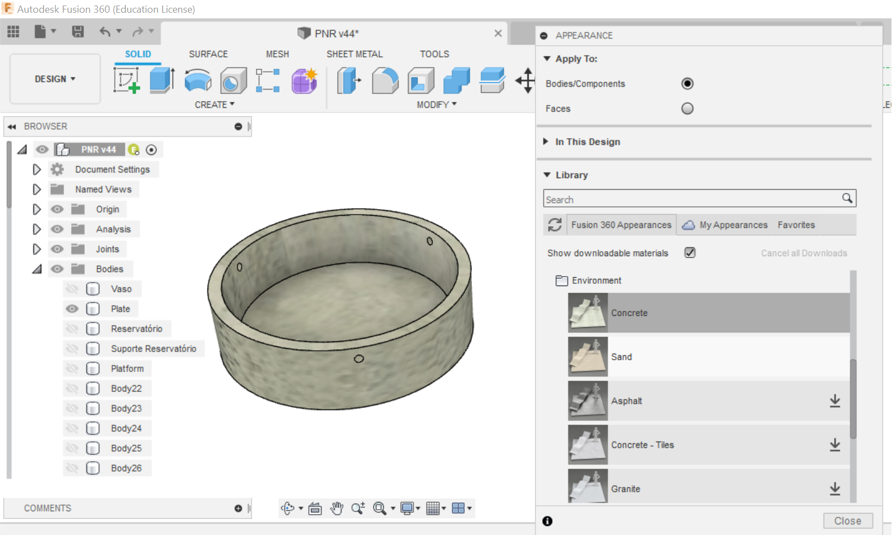{.center style="height:350px"}

#### Tutorials

Some bodies I didn't have idea how to model them, so I searched online tutorials. In this example below, I followed step by step to build a wheel.

| Tutorial  | My model  |
| :------:  | :------:  |
|<iframe width="560" height="315" src="https://www.youtube.com/embed/2-MjfWE8mmY" title="YouTube video player" frameborder="0" allow="accelerometer; autoplay; clipboard-write; encrypted-media; gyroscope; picture-in-picture" allowfullscreen></iframe> | 
 <iframe title="Wheel V10" frameborder="0" allowfullscreen mozallowfullscreen="true" webkitallowfullscreen="true" allow="fullscreen; autoplay; vr" xr-spatial-tracking execution-while-out-of-viewport execution-while-not-rendered web-share width="350" height="350" src="https://sketchfab.com/models/72c2987fc21c47aaa1e0fcd65a22e4b6/embed?autostart=1&ui_theme=dark"> </iframe> 
 |

#### Organization

There are many parts to my project. Because of this the Fusion browser became extensive, and I had a hard time recognizing which part I was modifying.

{style="height:400px"}
<figcaption><b>Browser of Autodesk Fusion</b></figcaption>

To reduce that I started to design small assemblies as components and after introduce them in the main assembly file. With it is faster to recognize and modify each group. Below I'm showing the single assemblies of Fixed Caster and Distance Sensor.

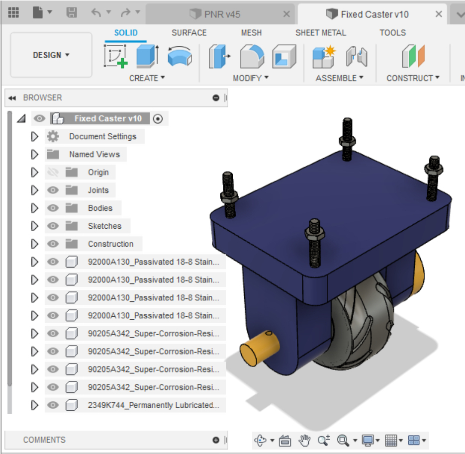{ style="height:300px"}  &nbsp;  {style="height:300px"}

### 3D Model

The 3D model of my final project:

You can download it below:

