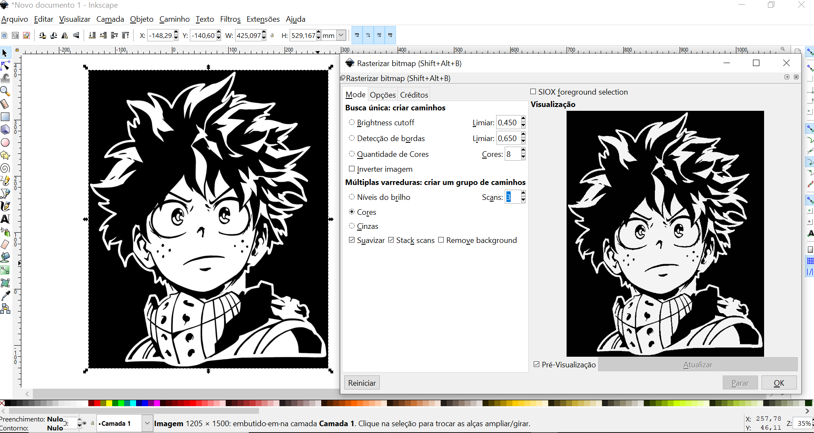
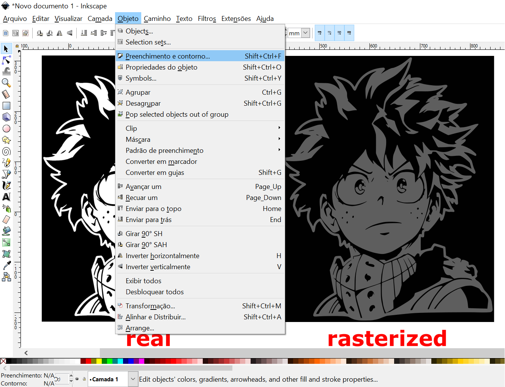
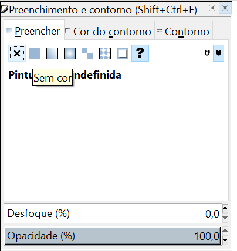
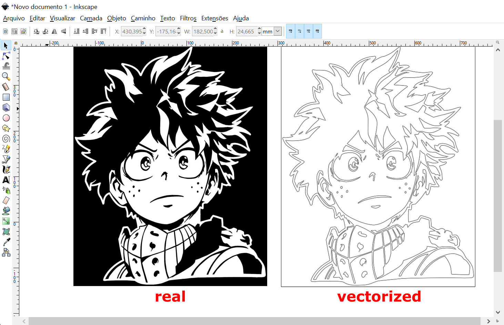
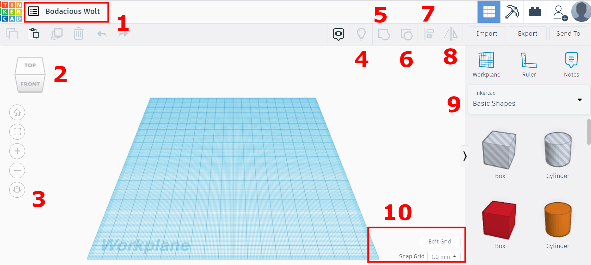

# 3. Computer Aided Design

## Assignment - Evaluate 2D and 3D software

* Model (raster, vector, 2D, 3D, render, animate, simulate, ...) a possible final project, compress your images and videos, and post it on your class page

## 2D software - Raster and Vector

### Research

[Source](https://helpx.adobe.com/photoshop-elements/key-concepts/raster-vector.html): Raster (or bitmap) images are described by an array or map of bits within a rectangular grid of pixels or dots. Vector images are described by lines, shapes, and other graphic image components stored in a format that incorporates geometric formulas for rendering the image elements.

* Raster

    At 100% the bitmap, or raster, version of the image looks almost the same as the vector version. Notice that as soon as the raster version is scaled, the pixels on the edge begin to show and the edges no longer look smooth.

    {.center style="height:250px"}

* Vector

    The vector image is created by defining points and curves. (This vector image was created using Adobe Illustrator.) When vector graphics are scaled, the edges remain crisp and sharp no matter the size.

    {.center style="height:250px"}

### Inkscape
With this software it's possible to convert images into vectors, so we can use them in operations of CNC (.dxf), laser cutter (.dxf or .pdf) and vinyl plotter (.svg).

How to raster an image:

1.  Choose a desired image and import it (shortcut Ctrl+i) in Inkscape.

    {style="height:290px"}
    &nbsp;

2.  Click on right mouse button and select `Rasterizar bitmap...`.

    {.center style="height:400px"}
    &nbsp;  

3.  There're many ways to rasterize the image. I think the best way is choosing the option **Colors**, and type how many of them (im my case two). As a result, the preview is similar to the real image.  

    {.center style="height:400px"}
    &nbsp;

4. Click and drag the image to the side. With the rasterized selected, go to tools bar **Objeto** > **Preenchimento e Contorno**.

    {.center style="height:400px"}
    &nbsp;

    {.center style="height:400px"}
    &nbsp;

5. First, we need to remove the fill at tab **Preencher** (button **sem cor**). And after stroke it at tab **Cor do Contorno** (button **cor uniforme**). The result is below, and can be saved as DXF, SVG, PDF and others types files.

| **Tab Preencher** | **Tab Cor do Contorno** |
| :---------------: | :---------------------: |
| {.center style="height:250px"} | {.center style="height:250px"} |

| Vectorized image |
| :---------------------: |
| {.center style="height:400px"} |

Here you can download [my Inkscape file](3downloads/Midoriya.7z) (.svg).

### Gimp
Gimp was used to edit all images of this website. This software allows you modify images: cut, remove background, add or highlight informative itens and more.

Here a step by step how to remove a background of a photo:

1.  Open the image in Gimp.

    {.center style="height:400px"}
    &nbsp;

2.  Select the tool **Seleção Livre**. The goal here is to contour the part of the image we'd like to leave at the board. The stroke is made point by point with the zoom support (Ctrl+Scroll mouse).   

    {.center style="height:250px"}
    <figcaption>
<b>Tool Free Selection</b>
</figcaption>

    

    <iframe width="560" height="315" src="https://www.youtube.com/embed/yG99oImbDwg" title="YouTube video player" frameborder="0" allow="accelerometer; autoplay; clipboard-write; encrypted-media; gyroscope; picture-in-picture" allowfullscreen></iframe>
    

## 3D software
In my professional life, I have already worked with some 3D software to model technical parts. Such as [AutoCAD](https://www.autodesk.com.br/products/autocad/free-trial), [Inventor](https://www.autodesk.com.br/products/inventor/overview) and [Fusion 360](https://www.autodesk.com/campaigns/education/fusion-360), all products of Autodesk. In the last year, I discovered a new one, called [Tinkercad](https://www.tinkercad.com/) for simple designs. I used it to make a tutorial for exchange students of [Insper](https://www.insper.edu.br/). So, the information below are parts of it.

####
### Tinkercad
Tinkercad is a free online, easy-to-use app for 3D design, electronics, and coding too. The users can draw furniture, architectural scale models, assembling programmable electronic circuits, etc. It also has a Gallery, to see examples of projects visit the [website](https://www.tinkercad.com/things).

#### Interface
This is the 3D project panel. Let’s know about its tools:

{.center style="height:350px"}

1.	With one click, you can change the name of the project;
2.	This cube allows you to rotate de camera or view side. It’ll help you to see all points of view in the project. Another way to do this is keeping the right mouse button pressed and drag the mouse;
3.	This menu allows you to control the camera. From the top to the bottom: “The home view”, when you click on it the workplane is moved to the position as showed in the picture above; “Selected view”, first select an object (with a click) and then use this button, the selected object will be fit in the view; “Zoom in”; “Zoom out” and switch between perspective and orthographic projection.
4.	To hide an object, click on it, then use Ctrl+H. This lamp icon makes all hidden objects visible again.
5.	Button number five can be used to group objects. Grouping shapes allows you to combine them to a single shape and to create cut-outs and holes. This represents the boolean “union” operation in Tinkercad. You can also use Ctrl + G for this operation;
6.	This button can be used to split up a previously defined group of shapes. You can also use Ctrl + Shift + G instead;
7.	Button number seven can be used to align objects;
8.	This last button allows you to mirror a shape in your scene;
9.	These are your basic shapes. You use them to create more complex shapes by creating cutouts and combining them into larger and more complex objects;
10.	You can change the grid with the tools in this area.

#### Testing

After knowing the tools, I decide to draw a Food Court.

<iframe width="640" height="400" src="https://www.tinkercad.com/embed/lhsqP1sI4Ps?editbtn=1" frameborder="0" marginwidth="0" marginheight="0" scrolling="no"></iframe>

To demonstrate how I designed the tables here is the step-by-step video:

<iframe width="560" height="315" src="https://www.youtube.com/embed/pkyc3ROgAQQ" title="YouTube video player" frameborder="0" allow="accelerometer; autoplay; clipboard-write; encrypted-media; gyroscope; picture-in-picture" allowfullscreen></iframe>

#### Tinkercad 3D Model
* Here you can download the [STL file](3downloads/Food Court.stl).

* And you can access the [Food Court](https://www.tinkercad.com/things/lhsqP1sI4Ps) in Tinkercad to use it.

####
### Fusion 360
I took a long time to design my final project because in each part I used to think about the processes of how to make it, what equipment or material I could choose or which one could be better. It was an exhausting assignment!

{style="height:200px"}
<figcaption><b>Just a little tired kkkkkk</b></figcaption>

I used a lot of commands to design the whole project. Here, I'll show some of them and give some tips too.

With my sketch on hand, I started to design the main part of my project, the vase of plant. I looked for a little one that I have in my house and took its measurements. Thinking about the geometrical forms that make up the vase helped me to model it easier.

#### First sketch

* I created a new sketch, and drew a circle with the dimension of the vase's base. I chose the plane XZ, but I realized that it'd be better if I had chosen the XY (the same orientation of CNC machines).

{.center style="height:350px"}

!!! tip "It's a good idea to put the middle of the model at the origin coordinates (0,0)!"

{.center style="height:350px"}

* I needed to model a cone with its top cut off, and the command **Loft** was perfect for that. To do this, were needed two profiles. One I already had (in the step above). The other, I generated on a new plane using the command **Offset Plane**.

  

  {style="height:350px"}
  <figcaption><b>The command Offset Plane</b></figcaption>
  

  

  {style="height:350px"}
  <figcaption><b>Two profiles on different planes</b></figcaption>
  

  

  {style="height:350px"}
  <figcaption><b>The command Loft</b></figcaption>
  

  

  { style="height:350px"}
  <figcaption><b>The result of the command Loft</b></figcaption>
  

* I followed the sequence above to design the entire vase, and used the command **Shell** to create a hollow cavity.

  

  {style="height:350px"}
  <figcaption><b>The command Shell</b></figcaption>
  

  

  | **3D Model**  | **Original Vase** |
  | :-----------: | :-----------:     |
  | 
 <iframe title="Plant Vase" frameborder="0" allowfullscreen mozallowfullscreen="true" webkitallowfullscreen="true" allow="fullscreen; autoplay; vr" xr-spatial-tracking execution-while-out-of-viewport execution-while-not-rendered web-share width="250" height="350" src="https://sketchfab.com/models/984c645ae9554f96a5047e8ea782d060/embed?autostart=1"> </iframe> 
| {style="height:350px"}  |

  

* With the main part drawn I could make it as a reference for others parts. In this step, the plate was being built following the same angle of the body of vase. After, by the command **Revolve**

{ style="height:350px"}
<figcaption><b>The sketch of plate</b></figcaption>

| The command Revolve |The result |
| :-----------------:  | :----------: |
| { style="height:400px"}  | { style="height:400px"} |

#### McMaster-Carr Component

* In the virtual PNR project, I used screws and nuts to fix its parts. It's not necessary to design them. Fusion has a 3D model library called McMaster-Carr Component, where we can seek to them. There, I pulled: screws M5x30mm, wing nuts and springs.

{ style="height:350px"}
<figcaption><b>McMaster-Carr Component</b></figcaption>

| Wing Nuts available | The ones I pulled |
| :-----------------:  | :----------: |
| { style="height:350px"}  | {style="height:350px"} |

!!! tip "Another free 3D model library is the [GrabCAD](https://grabcad.com/)"
    It's an online community where people share their projects. I accessed it a couple of times. The first, I was looking for a example of water pump.

    {.center style="height:350px"}

    {.center style="height:350px"}

#### Changing Appearance

In Fusion, it's possible to atributte characteristics of materials for the parts. Press the letter `A` on the board, we can active the command **Appearance**. There're many types of materials, as metal, plastic, wood, and even concrete. Here, I aplied the concrete material in the part called Plate.

{.center style="height:350px"}

#### Tutorials

Some bodies I didn't have idea how to model them, so I searched online tutorials. In this example below, I followed step by step to build a wheel.

| Tutorial  | My model  |
| :------:  | :------:  |
|<iframe width="560" height="315" src="https://www.youtube.com/embed/2-MjfWE8mmY" title="YouTube video player" frameborder="0" allow="accelerometer; autoplay; clipboard-write; encrypted-media; gyroscope; picture-in-picture" allowfullscreen></iframe> | 
 <iframe title="Wheel V10" frameborder="0" allowfullscreen mozallowfullscreen="true" webkitallowfullscreen="true" allow="fullscreen; autoplay; vr" xr-spatial-tracking execution-while-out-of-viewport execution-while-not-rendered web-share width="350" height="350" src="https://sketchfab.com/models/72c2987fc21c47aaa1e0fcd65a22e4b6/embed?autostart=1&ui_theme=dark"> </iframe> 
 |

#### Organization

There are many parts to my project. Because of this the Fusion browser became extensive, and I had a hard time recognizing which part I was modifying.

{style="height:400px"}
<figcaption><b>Browser of Autodesk Fusion</b></figcaption>

To reduce that I started to design small assemblies as components and after introduce them in the main assembly file. With it is faster to recognize and modify each group. Below I'm showing the single assemblies of Fixed Caster and Distance Sensor.

{ style="height:300px"} {style="height:300px"}

#### Fusion 3D Model

The 3D model of my final project:

 <iframe title="PNR V46" frameborder="0" allowfullscreen mozallowfullscreen="true" webkitallowfullscreen="true" allow="fullscreen; autoplay; vr" xr-spatial-tracking execution-while-out-of-viewport execution-while-not-rendered web-share width="600" height="450" src="https://sketchfab.com/models/616ff5e6204441378853cf1efcb3b29d/embed?autospin=0&autostart=1&ui_theme=dark"> </iframe> 

You can download the Fusion file (.f3z) below:

[3D Model PNR Project](3downloads/PNR v46.f3z)

