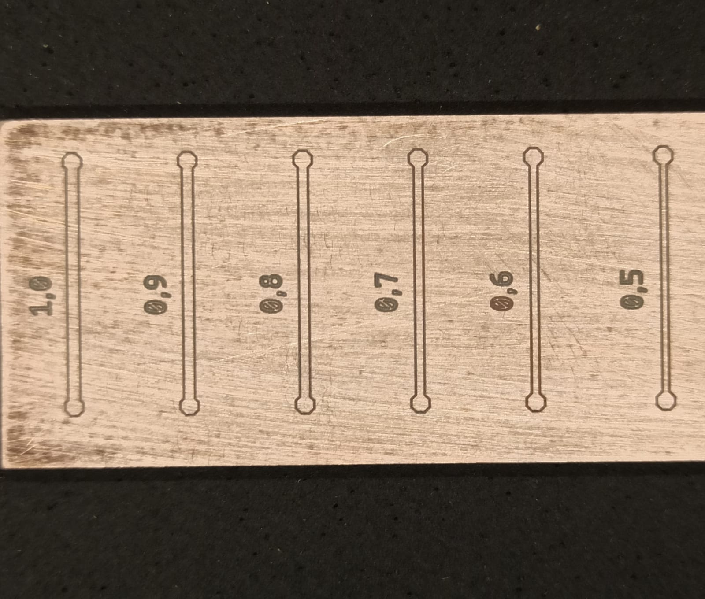
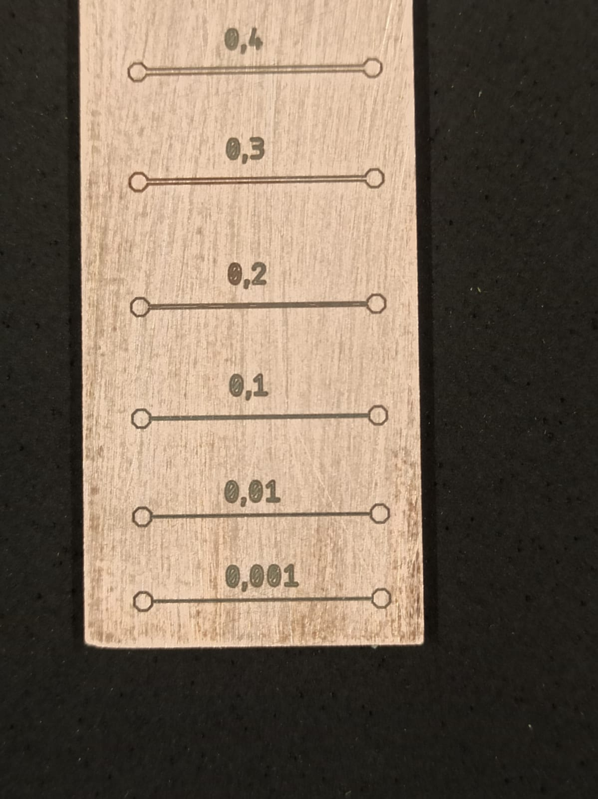
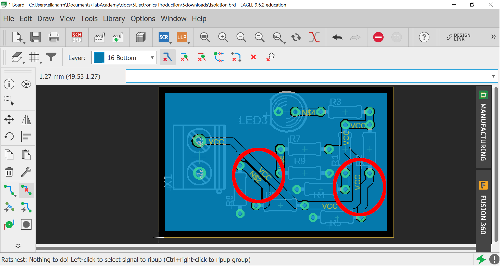

# 5. Electronics Production

## Group assignment

* Characterize the design rules for your PCB production process: document feeds, speeds, plunge rate, depth of cut (traces and outline) and tooling.
* document your work (in a group or individually).

## Design rules for PCB production

### Minimum trace width

The minimum trace width that we were able to produce using both the Roland MDX-540 and Rolland MDX-40A was **0,6mm/23mils** due to two factors:

 - Unevenness of phenolic based PCB's
 - Difficulty of finding micro end-mills at the Brazilian market

{.center style="height:400px"}

As it's difficult to find micro end-mill to do the engraving part of the boards we end up using tapered mills instead, which causes some problems as the deeper you go into the material, thicker the mill gets.

#### File to test

Similar to the file [linetest](5downloads/linetest.png) given by Neil for the students of class 2021, we made a simple PCB using the software Autodesk Eagle. The goal here was to test the performance of Roland MDX-540 milling different traces width (range between 0.001 and 1.0 mm).

{.center style="height:450px"}

To generate the gcode with its commands and parameters the software [FlatCAM](http://flatcam.org/download) was used. In it, we can adjust depth cut, multi-depth, feed rate, spindle speed...

{.center style="height:450px"}

!!! Important "For more details about how to prepare files and to mill a PCB using the machine Roland MDX-540 see the [Individual Assignment](https://rmeliana.github.io/FabAcademy/5Electronics%20Production/5Electronics%20Production/#individual-assignment)."

#### Milling

Using a tapered end-mill of Ø 0,1mm (and 20°) and depth cut of -0,14mm (the default depth of -0,11mm was not enough, so we added more 0,03mm to this parameter), we had the result below. We can note that was removed much more material than necessary due to the format of the mill.

{style="height:200px"}
<figcaption><b>Tapered end mill</b></figcaption>

{style="height:250px"} &nbsp;
{style="height:250px"}
<figcaption><b>PCB milled</b></figcaption>

Using the equipment called stereoscope microscope Stemi 508 and the software AxioVision, we were able to measure the real width of the traces. Just taking a snapshot with super zoom and using the dimension command.

{style="height:350px"}
<figcaption><b>Stereoscope microscope Stemi 508</b></figcaption>

<html>
  <head>
    <link rel="stylesheet" href="stylesheets/galery.theme.css">
    <link rel="stylesheet" href="stylesheets/galery.min.css">
  </head>

  <body>
    

      

      

      

      

      <figure class="item">
        <h1></h1>
      </figure>

      <figure class="item">
        <h1></h1>
      </figure>

      <figure class="item">
        <h1></h1>
      </figure>

      <figure class="item">
        <h1></h1>
      </figure>

      

        <a href="#item-1" class="control-button">.</a>
        <a href="#item-2" class="control-button">.</a>
        <a href="#item-3" class="control-button">.</a>
        <a href="#item-4" class="control-button">.</a>
      

    

  </body>
</html>

Here is a table with the virtual widths of the traces (Eagle parameters) and the real ones (milled by a tapered end-mill).

| Virtual | Real |
|:-------:|:----:|
| 1,0mm   |0,82mm|
| 0,9mm   |0,72mm|
| 0,8mm   |0,62mm|
| 0,7mm   |0,52mm|
| 0,6mm   |0,42mm|
| 0,5mm   |0,32mm|
| 0,4mm   |0,22mm|
| 0,3mm   |0,12mm|

Therefore, the minimum trace width that we were able to produce using the Roland MDX-540, depth cut of -0,14mm, is **0,6mm/23mils**.

#### Files

* [Eagle](5downloads/Traces_Eagle.7z) files;
* [FlatCAM](5downloads/Traces_FlatCAM.FlatPrj) files;
* [Gcodes](5downloads/Traces_Gcode.7z) files.

### Minimum isolation

The minimum isolation hits on the same barrier as the trace width. If we get a cut depth deeper the tapered end-mill tool starts milling away the other traces during isolation milling.

In the file below there are some traces near each other. We milled three PCBs with the same layout, but changing the depth cut.

{.center style="height:450px"}

{.center style="height:450px"}
{.center style="height:450px"}
{.center style="height:450px"}
{.center style="height:450px"}

#### Files
* [Eagle](5downloads/Isolation_Eagle.7z) files;
* [FlatCAM](5downloads/Isolation_FlatCAM.FlatPrj) files;
* [Gcodes](5downloads/Isolation_Gcode.7z) files.

### Feeds & Speeds

| Operation | Tool        | Cut Z(mm) | Multi-Depth(mm) | Travel Z(mm) | Feed Rate X-Y(mm/s) | Feed Rate Z(mm/s) | Spindle Speed(RPM) |
|:----------|:-----------:|----------:|----------------:|-------------:|--------------------:|------------------:|-------------------:|
| Drill     | 0.5mm-1.2mm |     -1.65 |            0.55 |           15 |                 450 |               650 |              12000 |
| Engrave   | 0,1mm" 30º    |     -0.11 |            0.06 |              |                 450 |               650 |              12000 |
| Profile   | 1/8"        |     -1.65 |            0.55 |           15 |                 450 |               650 |               8000 |

## Individual assignment

* Make an in-circuit programmer by milling and stuffing the PCB, test it, then optionally try other PCB fabrication process.

