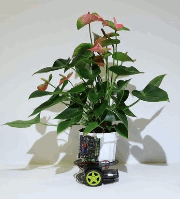
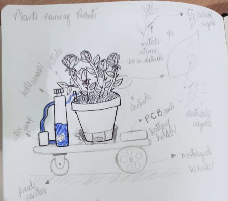

#1. Principles and Practices

##Assignment

* plan and sketch a potential final project

During this week I worked on defining my final project and started to create the documentation.
The project idea came from the task of water and put my plants under sunlight. I love to take care
of them, but sometimes I don't have enough time, specially when I'm travelling or so busy with work.
Majority of my plants is rose bushes which need many hours of daylight according to this [article](https://homeguides.sfgate.com/roses-need-full-sun-71200.html).
Therefore, I pass my days moving them to sunny places in my yard. So, why not to build a robot to do it for me? :smirk:

{: align=center style="height:240px"}

##References

In my research, I discovered some references to embase my project.
The first one is called [Hexa](https://www.businessinsider.com/the-hexa-robot-can-take-care-of-your-plants-2018-7), a walking succulent plant robot. It can move the plant in and out of shade and stomps when it needs watering. However, its design is very 
sophisticated. 

{: align=left style="height:215px"} 
<video controls width="400" align="center">

    <source src="https://user-images.githubusercontent.com/80481667/121596606-03fdfb80-ca16-11eb-96ab-62e88dee66aa.mp4"
            type="video/mp4">

    Sorry, your browser doesn't support embedded videos.
</video>

The second is [Elowan](https://www.media.mit.edu/projects/elowan-a-plant-robot-hybrid/overview/), a cybernetic lifeform.
The project uses the plant signals to guide it toward light. 

{: align=left style="height:300px"}
<iframe width="534" height="300" src="https://www.youtube.com/embed/rptKlKZc7cs" title="YouTube video player" frameborder="0" allow="accelerometer; autoplay; clipboard-write; encrypted-media; gyroscope; picture-in-picture" allowfullscreen></iframe>

##PNR - Plant Nanny Robot

I'm not an expert in drawing, but here's my sketch:

{: align=left style="height:300px"}

###Description

