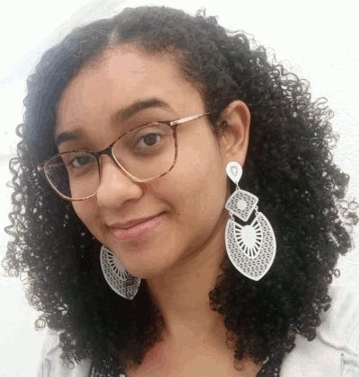
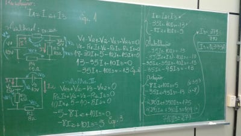
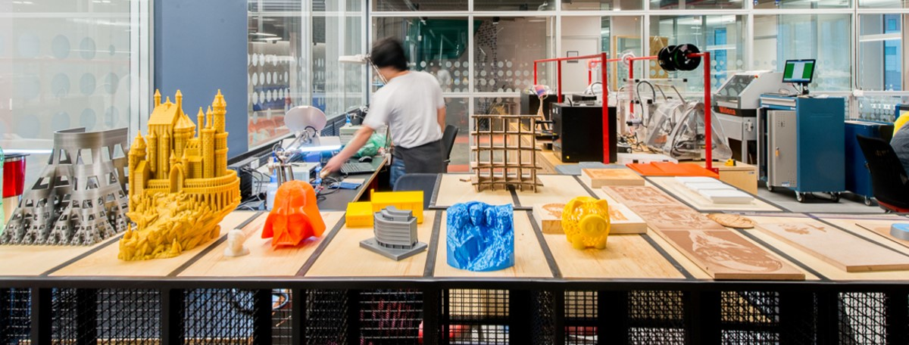
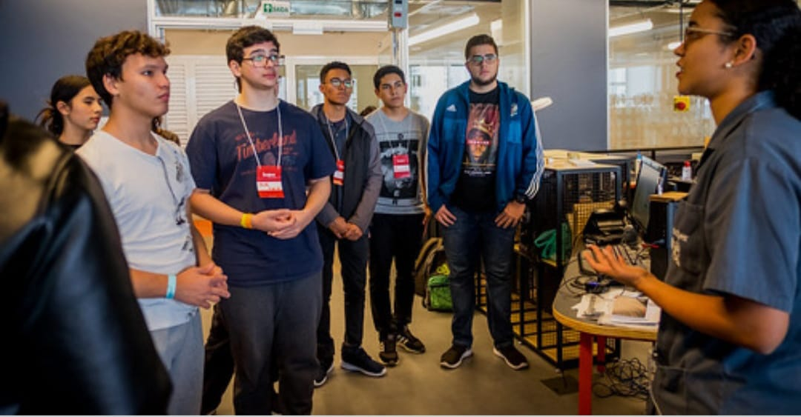
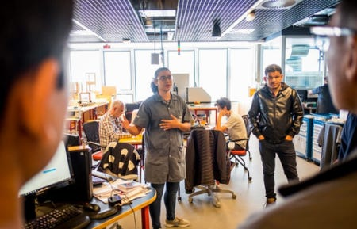

# About

{: align=center  style="height:240px"}

Hello folks! I'm **Eliana Rodrigues Martins**, an electrical engineer, who is
exploring the digital fabrication world.

## My background

I was born in Sao Paulo, Brazil, and since my adolescence, I have been in the electricity field.
I started taking toys and household appliance apart to know how they worked and sometimes I tried to fix them.
I always followed my father on domestic repairs in our house.

I took my first course in the area (**maintenance electrician**) when I was sixteen,
in 2002, at Senai. 
With the experience, I wanted to learn more about other areas, such as:
programming and mechanics of machining. I used to dream of developing a robot. Therefore, I
invested two years of my life in a **mechatronics technical course**, which was a big challenge
for me, because I wasn't good enough at Assembly language programming and  used to fail in
the machining. Even so, I stood out in my eletronic class and got a vacancy at 
[**Knowledge Olympics**](https://www.fiesp.com.br/noticias/sao-paulo-conquista-35-medalhas-e-vence-a-olimpiada-do-conhecimento-nacional/)
(state and national competition), as electronic assembler and programmer at the modality called
Manufatura Integrada.

{: align=center style="height:300px"}
{: align=center  style="height:300px"}

In 2010, I began my degree course in **Electrical Engineering**, and at the same time, I
worked as a designer at refractories civil area, modeling parts in AutoCad and Inventor softwares.
I have gotten two internships: the first at an industry which manufactured agricultural machines and 
power generators, and the second at an electricity distribution company.

Finally, in February 2017, I found my true passion, **teach**. I have worked for six months as teacher at a technical
school, teaching disciplines of Math, Electronic, NR-10,Pneumatic, among other. It's incredible how knowledge and
sharing information can change the students lives.

{: align=center  style="height:300px"}

### Fab Lab Insper

In August of 2017, I joined the technical team of [Fab Lab Insper](https://www.insper.edu.br/fab-lab/)
as a lab technician.

{: align=center  style="height:200px"}

Here, I introduce the digital fabrication to professors, students and the community. In classes,
I help students develop their academic projects using the rapid-prototyping, with open source softwares and
low cost materials. So, I teach them how to operate the machines and tools, and what methods are better to reach
the goals. 
There is a day, called Open Day, when the team receive people from everywhere who want to develop and share ideas.
On this day, the use of machines and environment is free for the community.

{: align=center  style="height:300px"}
{: align=center  style="height:300px"}