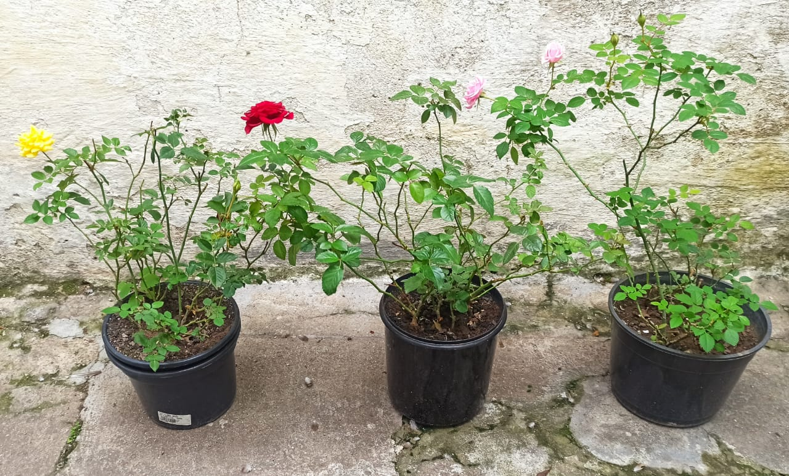
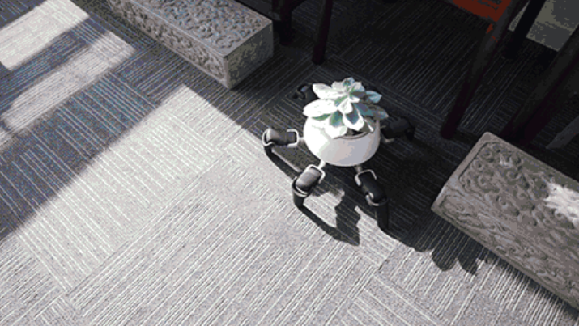

# 1. Principles and Practices

##Assignment

* plan and sketch a potential final project

During this week I worked on defining my final project and started to create the documentation.
The project idea came from the task of water and put my plants under sunlight. I love to take care
of them, but sometimes I don't have enough time, specially when I'm travelling or so busy with work.
Majority of my plants is rose bushes which need many hours of daylight according to this [article](https://homeguides.sfgate.com/roses-need-full-sun-71200.html).
Therefore, I pass my days moving them to sunny places in my yard.

{: align=center style="height:240px"}

In my research, I discovered some references to embase my project. The first one is called [Hexa](https://www.businessinsider.com/the-hexa-robot-can-take-care-of-your-plants-2018-7),
a walking succulent plant robot. It can move the plant in and out of shade and stomps when it needs watering.

{: align=center style="height:240px"}

# 2. Project Management

# 3. Computer Aided Design

# 4. Computer Controlled Cutting
# 5. Electronics Production
# 6. 3D Scanning and Printing
# 7. Electronics Design
# 8. Computer Controlled Machining
# 9. Embedded Programming
# 10. Mechanical Design, Machine Design
# 11. Input Devices
# 12. Moulding and Casting
# 13. Output Devices
# 14. Embedded Networking and Communications
# 15. Interface and Application Programming
# 16. Wildcard Week
# 17. Applications and Implications
# 18. Invention, Intellectual Property and Business Models
# 19. Project Development